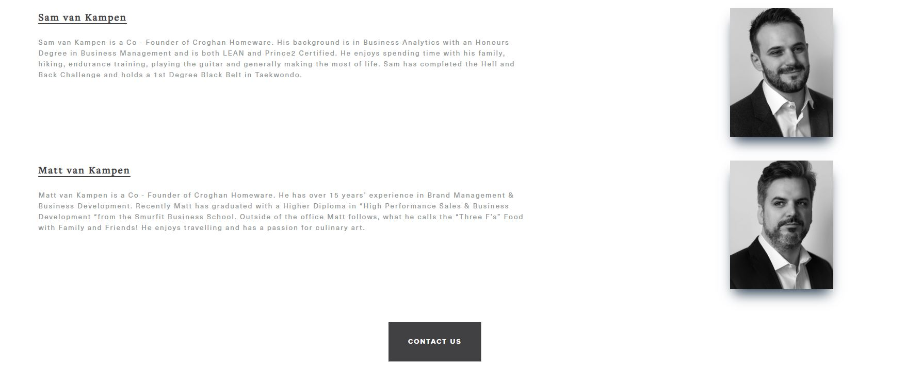

Welcome to Croghan

This webpage has been created and designed to act as marketing material as part of a *Croghan* webshop going live.
The Croghan webshop is a real project that I am currently working on with a webdesign team however in order to gain supplier buy in we require a clean and concise landing page that allows our perspective suppliers understand what we are all about at *Croghan*

The webpage is targeted towards a curated range of suppliers that create kitchenware with a certain ethos ;

- Enviromentally friendly
- Sustainably sourced
- Giving back to the community
- Quality Gauranteed

---

## Preparation

- **Wire Frame**
    1. During the planning phase of the project a wireframing tool called balsamiq was used. 
    2. By using a wireframe the webpage could be visualised and the number of sections and functions understood from a highlevel.
    3. Throughout the project the wireframe was used as a guide of what was set out to achieve.
    4. The wireframe file can be viewed here [Link](../croghan/assets/wireframe/Croghan_wire_frame_v1.bmpr)

---

## Features

### Existing Features

- **Navigation Menu**
    1. A naviagtion menu has been added to the webpage on all three pages with four buttons "Home", "About", "Contact" and the Logo which deafults to the homepage.
    2. The Navigation bar has been style consistently for ease of use and an enjoyable expierence as the vistor runs through each section.

- **Landing Page Image**
    1. The landing page displays a hero image with a text overlay "Buy Once Buy with Confidence" together these two eliments introduce the vistor to what the webpage is here for. 
    2. The hero image is set out to capture the visitors attention and to encourage the vistor to read more.

- **Brand Values Section**
    1. A brand values section has been displayed to give the visitor insight into Croghan's beliefs and provides them with the oppertunity to quickly understand if Croghan is a good fit for them as a retailer.
    2. This section should act as the elevator pitch giving the vistor (potential supplier) enough information to enquiry more.

- **Find Us Section**
    1. On the homepage a where to find us section has been added, this section shows where Croghan will be attending European tradeshows.
    2. This section provides the visitor with the oppertunity to talk with Croghan face to face at a trade show.

- **Contact Us Button**
    1. A button has been added at the bottom of the homepage and about us page just above the footer. This button acts as a call to action to fill out the contact us form on the contact us page. 
    2. The button has a hover effect and an active effect to ensure it is clear for the user that this is a functional button. The button will move the user to the contact page.

- **Footer**
    1. Within the footer the social tags can been seen for facebook, instagram, twitter and youtube. 
    2. Each icon if clicked will load out a new page for the visitor with the desired Social Media Account showing on a new tab.
    3. The background has been given a dark grey background to provide contrast to the rest of the page with the icons styled in an off white to standout on the footer.
    4. The footer is consistent throughout each page is responsive for desktop, tablet and mobile.

- **About Us Section**
    1. The next page the vistor will see along the naviation menu is the "about us" section. Initially greeted with a hero image with a text overlay. It purpose is to get the visitor to read more.
    2. This page is here to demonstrate to the vistor who the founders of Croghan are and provide a backgorund into both Sam & Matt.
    3. Along with a short paragraph of text is a portrait photo of each founder so the visitor can get a sense of who they are going to be doing business with.
    4. The page remains consistent in its call to action button for "Contact Us" and its footer containing the socials.

- **Contact Us Section**
    1. When the visitor clicks either the call to action button "contact us" or naviagtes to the contact page they will move to the page with a contact form.
    2. The form is formatted and provides an open text area for the visitor to submit a message.
    3. The form has a hover effect added to the button to ensure the visitor understand this is functional button.

---

## Testing

---

### Validator Testing

- HTML
    - No errors were returned when passing through the official W3C validator

- CSS
    - No errors were found when passing through the official (Jigsaw) validator

---
# Deployment

- The site was deployed using GitHub Pages as follows ;
    - In the GitHub repository, navigate to the Settings tab
    - From the code and automation section select Pages
    - From the source section drop-down menu, select the Master Branch
    - Once the master branch has been selected, the page will be automatically refreshed with a detailed ribbon display to indicate the successful deployment.

The live link can be found here - https://svankampen.github.io/croghan/

# Credits 

